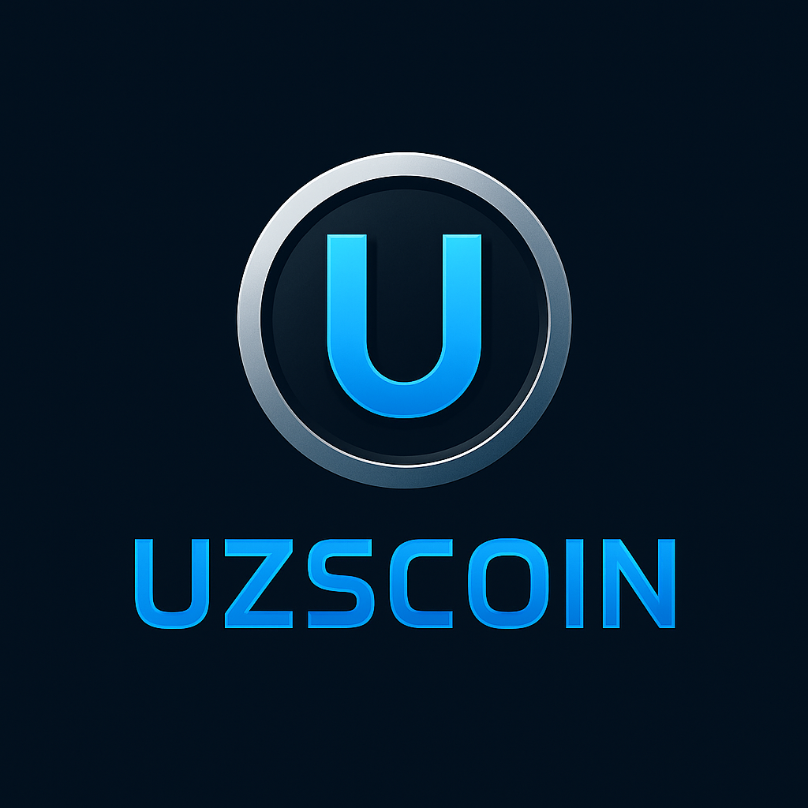

# 💰 UZSCOIN — Web3 Clicker Game on Firebase

**UZSCOIN** is a Web3 click-to-earn game inspired by Notcoin. Players can earn UZS tokens by tapping, unlocking skins, boosts, and achievements. Compete on global leaderboards and complete daily tasks to climb the ranks — all powered by Firebase.

---

 <!-- Замените путь, если другой -->

---

## ✨ Features

- 👆 **Click-to-Earn Gameplay** — Tap to earn UZS tokens.
- 🔐 **Firebase Authentication** — Secure and fast login.
- 🔄 **Realtime Sync** — User data and balances update instantly.
- 🏆 **Leaderboards** — Compete globally with other players.
- 🎯 **Achievements System** — Earn rewards by reaching goals.
- 🎨 **Skins System** — Unlock visual upgrades for your tapper.
- ⚡ **Boosts** — Multiply your earnings with active boosts.
- 📅 **Daily Tasks** — Stay active and get rewarded.

> ⚠️ NFT minting and marketplace trading are not supported in this version.

---

## ⚙️ Tech Stack

- [Next.js](https://nextjs.org/) — React framework for full-stack web apps
- [TypeScript](https://www.typescriptlang.org/) — Type-safe development
- [Firebase](https://firebase.google.com/) — Auth and Realtime Database
- [Tailwind CSS](https://tailwindcss.com/) — Modern UI styling

---

## 📦 Installation

```bash
git https://github.com/abdulloh5007/my-uzs-coin.git
cd uzscoin
npm install
